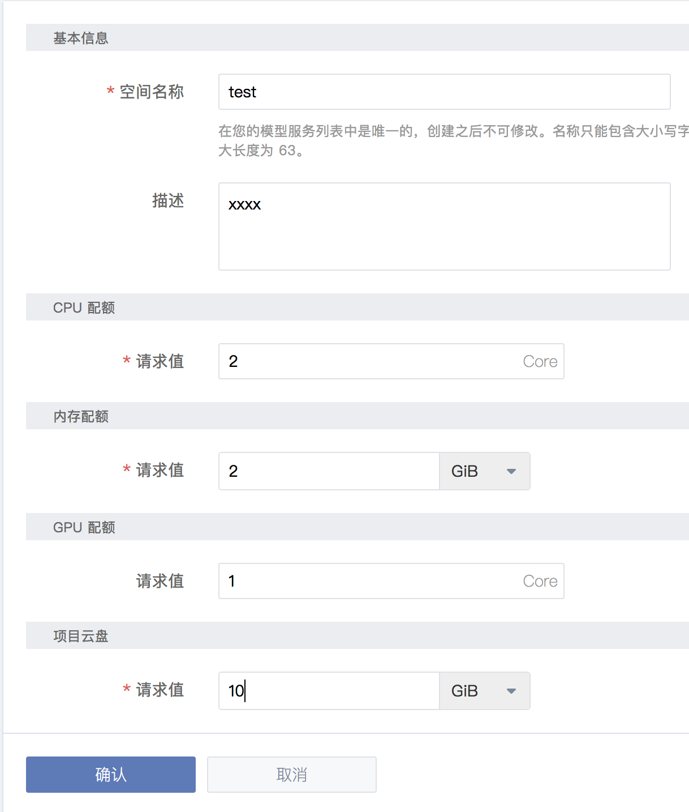
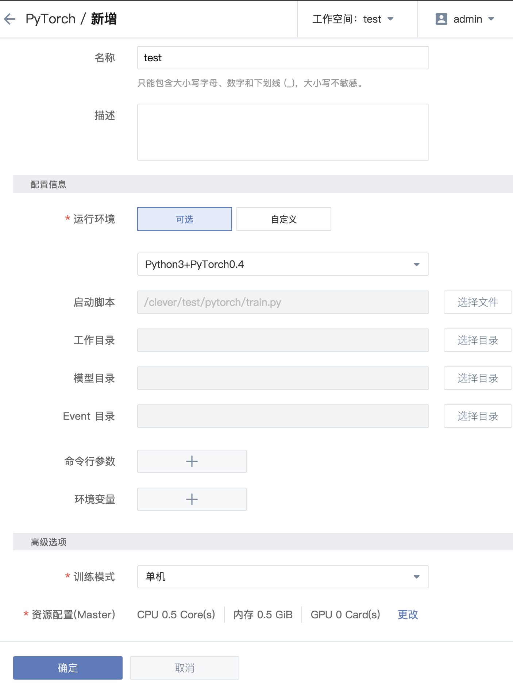
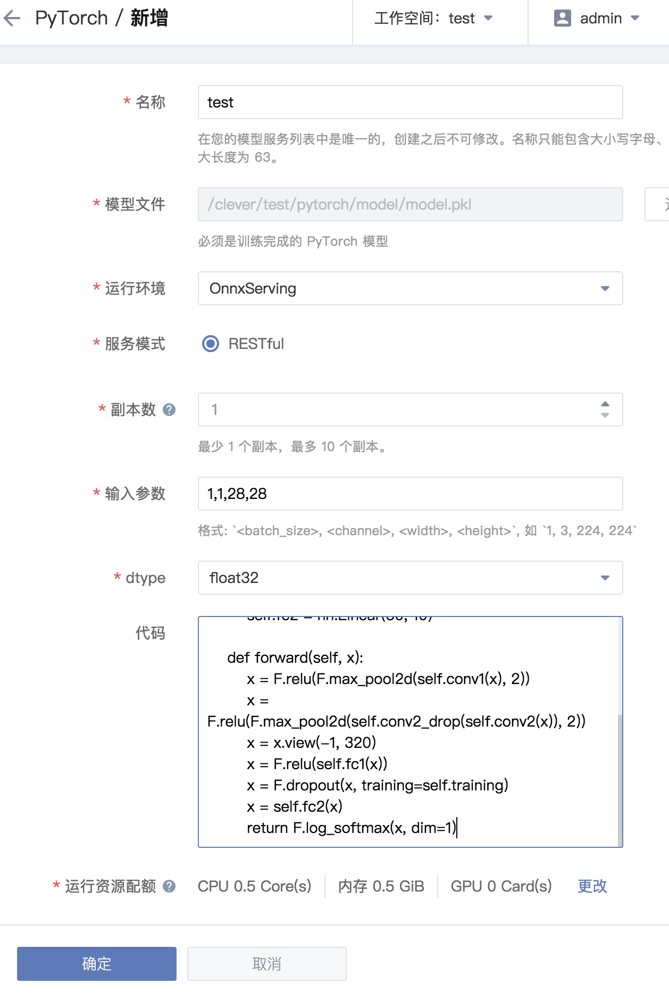

# Clever Pytorch Support

单机教程
--- 

## 工作空间

- 点击 `新增` 工作空间
- 填写 `空间名称` 与 适当的 `CPU配额`，`内存配额`，`项目云盘` 容量，若需要使用 `GPU` 卡，请填写适当的 `GPU` 配额 
## 团队云盘与文件上传
创建团队空间完毕后，系统会对团队空间进行自动初始化
- 点击 `团队云盘` 标签栏，等待初始化完毕
- 打开 `团队云盘` 后，有 `public` 和 `<workspacename>` 文件夹，选择其中一个文件夹，并上传训练数据
- 此处选择 `<workspacename>` 文件夹
- 点击 `上传文件夹`，并选择 `mnist-pytorch` 文件夹
- 在 `mnist-pytorch` 文件夹中创建 `model` 文件夹

## 训练作业

- 修改 `/clever/<workspacename>/mnist-pytorch/``train.py` 文件中的 `torch.save(... , "路径")` 存储路径，为 `/clever/<workspacename>/...`
- 选择 `Pytorch` 
- 填写 `名称`，选择 `运行环境`，`启动脚本(/clever/<workspacename>/mnist-pytorch/train.py)` 等等相关基本信息
- 修改配额为 `cpu:0.5`，`内存:0.5`
- 提交训练作业
- 等待训练作业完成
- 查看 `团队云盘` 中 `/clever/<workspacename>/mnist-pytorch/model` 下是否有模型

## 模型服务

- 点击 `模型服务` 选择 `Pytorch`
- 点击 `新增` 按钮
- 填写 `名称` 选择模型文件 `/clever/<workspacename>/mnist-pytorch/model/model.pkl`
- 选择`运行环境`，填写`副本数` 1
- 输入参数 `1,1,28,28`
- `dtype` 选择 `float32`
- 将模型网络代码复制黏贴进入 `代码` 中

```Python
# -*- coding: utf-8 -*-

import torch.nn as nn
import torch.nn.functional as F


class Net(nn.Module):
    def __init__(self):
        super(Net, self).__init__()
        self.conv1 = nn.Conv2d(1, 10, kernel_size=5)
        self.conv2 = nn.Conv2d(10, 20, kernel_size=5)
        self.conv2_drop = nn.Dropout2d()
        self.fc1 = nn.Linear(320, 50)
        self.fc2 = nn.Linear(50, 10)

    def forward(self, x):
        x = F.relu(F.max_pool2d(self.conv1(x), 2))
        x = F.relu(F.max_pool2d(self.conv2_drop(self.conv2(x)), 2))
        x = x.view(-1, 320)
        x = F.relu(self.fc1(x))
        x = F.dropout(x, training=self.training)
        x = self.fc2(x)
        return F.log_softmax(x, dim=1)

```
- 运行配额选择 `cpu:0.5 内存:0.5`
- 提交任务，等待启动




## 测试服务
安装 virtualenv
```shell
$ pip install virtualenv
```

创建虚环境
```shell
$ virtualenv venv
```

启动虚环境
```shell
$ . venv/bin/activate
```

安装依赖
```shell
(venv)$ pip install -r requirements.txt
```

运行 client
```shell
(venv)$ python graphpipe-client.py
```

运行结果:

```shell
(1, 1, 28, 28)
[[-inf -inf -inf -inf -inf   0. -inf -inf -inf -inf]] #(一共10个数字，0.所对应的是数字5，测试时请自行区别)
```

graphpipe-client.py 代码
```Python
from io import BytesIO
from PIL import Image, ImageOps
import numpy as np
import requests

from graphpipe import remote

data = np.array(Image.open("<图片路径>"))
data = data.reshape([1] + list(data.shape))
data = np.rollaxis(data, 1, 1).astype(np.float32)  # channels first
data = np.expand_dims(data, axis=0)
data.astype(np.float32)
print(data.shape)

pred = remote.execute("http://<RESTful地址>", data)
print(pred)
```

分布式教程
---
## 工作空间

- 点击 `新增` 工作空间
- 填写 `空间名称` 与 适当的 `CPU配额`，`内存配额`，`项目云盘` 容量，若需要使用 `GPU` 卡，请填写适当的 `GPU` 配额 
## 团队云盘与文件上传
创建团队空间完毕后，系统会对团队空间进行自动初始化
- 点击 `团队云盘` 标签栏，等待初始化完毕
- 打开 `团队云盘` 后，有 `public` 和 `<workspacename>` 文件夹，选择其中一个文件夹，并上传训练数据
- 此处选择 `<workspacename>` 文件夹
- 点击 `上传文件夹`，并选择 `pytorch-distribute` 文件夹
- 在 `pytorch-distribute` 文件夹中创建 `model` 文件夹

## 训练作业

- 修改 `/clever/<workspacename>/pytorch-distribute/`文件夹下 `train.py` 文件中的 `torch.save(... , "路径")` 存储路径，为 `/clever/<workspacename>/...`
- 修改 `train.py` 文件中的 `dataset = datasets.MNIST()` 下的路径为 `/clever/<workspacename>/pytorch-distribute/data`
- 选择 `训练作业` 中的 `Pytorch` 
- 填写 `名称`，选择 `运行环境`，`启动脚本(/clever/<workspacename>/pytorch-distribute/train.py)`，训练模式选择`分布式`，`节点数量（Worker）` 填写 `1`
- 修改 `Master` 和 `Worker` 配额为 `cpu:0.5`，`内存:0.5` 


- 提交训练作业
- 等待训练作业完成
- 查看 `团队云盘` 中 `/clever/<workspacename>/pytorch-distribute/model` 下是否有模型

## 模型服务

- 点击 `模型服务` 选择 `Pytorch`
- 点击 `新增` 按钮
- 填写 `名称` 选择模型文件 `/clever/<workspacename>/pytorch-distribute/model/model.pkl`
- 选择`运行环境`，填写`副本数` 1
- 输入参数 `1,1,28,28`
- `dtype` 选择 `float32`
- 将模型网络代码复制黏贴进入 `代码` 中

```Python
# -*- coding: utf-8 -*-

import torch.nn as nn
import torch.nn.functional as F


class Net(nn.Module):
    def __init__(self):
        super(Net, self).__init__()
        self.conv1 = nn.Conv2d(1, 10, kernel_size=5)
        self.conv2 = nn.Conv2d(10, 20, kernel_size=5)
        self.conv2_drop = nn.Dropout2d()
        self.fc1 = nn.Linear(320, 50)
        self.fc2 = nn.Linear(50, 10)

    def forward(self, x):
        x = F.relu(F.max_pool2d(self.conv1(x), 2))
        x = F.relu(F.max_pool2d(self.conv2_drop(self.conv2(x)), 2))
        x = x.view(-1, 320)
        x = F.relu(self.fc1(x))
        x = F.dropout(x, training=self.training)
        x = self.fc2(x)
        return F.log_softmax(x, dim=1)

```
- 运行配额选择 `cpu:0.5 内存:0.5`
- 提交任务，等待启动


## 测试服务

安装 virtualenv
```shell
$ pip install virtualenv
```

创建虚环境
```shell
$ virtualenv venv
```

启动虚环境
```shell
$ . venv/bin/activate
```

安装依赖
```shell
(venv)$ pip install -r requirements.txt
```

运行 client
```shell
(venv)$ python graphpipe-client.py
```

运行结果:

```shell
(1, 1, 28, 28)
[[-inf -inf -inf -inf -inf   0. -inf -inf -inf -inf]] #(一共10个数字，0.所对应的是数字5，测试时请自行区别)
```

graphpipe-client.py 代码

```Python
from io import BytesIO
from PIL import Image, ImageOps
import numpy as np
import requests

from graphpipe import remote

data = np.array(Image.open("<图片路径>"))
data = data.reshape([1] + list(data.shape))
data = np.rollaxis(data, 1, 1).astype(np.float32)  # channels first
data = np.expand_dims(data, axis=0)
data.astype(np.float32)
print(data.shape)

pred = remote.execute("http://<RESTful地址>", data)
print(pred)
```


